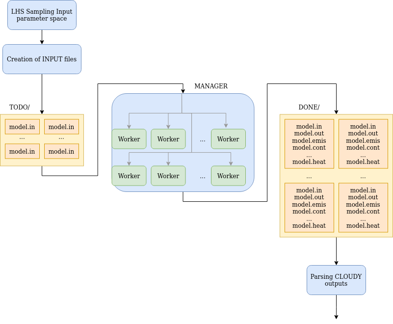

.. pyNublado documentation master file, created by
   sphinx-quickstart on Sat Apr  2 21:15:32 2022.
   You can adapt this file completely to your liking, but it should at least
   contain the root `toctree` directive.

pyNublado
=====================================

pyNublado, from python + Nublado, its a python package to be used in running large amounts of CLOUDY models.
Cloudy is a spectral synthesis code designed to simulate conditions in interstellar matter under a broad range of conditions.
pyNublado can be used to sample efficiently the input parameter space, create input files for CLOUDY, running the models on CLOUDY 
on multiple workers and parse the results, all from python.

.. toctree::
   :maxdepth: 2
   :caption: Contents:

   readme.rst
   installation.rst
   bpass.rst
   usage.rst
   modules.rst
   test.rst

Indices and tables
==================

* :ref:`genindex`
* :ref:`readme`
* :ref:`installation`
* :ref:`modules`
* :ref:`modindex`
* :ref:`search`
